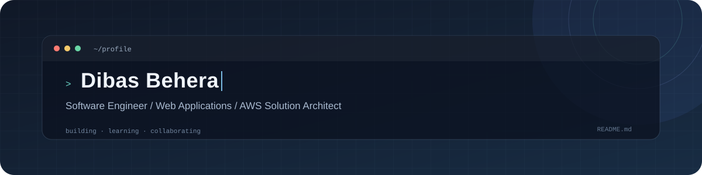

  

  <a href="https://github.com/dibasbehera7?tab=repositories">REPOSITORIES</a>
  &nbsp; / &nbsp;
  <a href="https://www.linkedin.com/in/dibasbehera7/">LINKEDIN</a>
  &nbsp; / &nbsp;
  <a href="https://www.hackerrank.com/dibasbehera">HACKERRANK</a>
  &nbsp; / &nbsp;
  <a href="https://instagram.com/connectdibas">INSTAGRAM</a>

 

### A little about me

I'm a software engineer with **7+ years in the software industry**. I build web applications, enjoy taking on challenging problems, and am currently learning system design.

<table>
  <tr>
    <td width="33%" valign="top">
      01 / BUILDING 
      <strong>Web applications</strong> 
      Turning ideas into useful software.
    </td>
    <td width="33%" valign="top">
      02 / EXPLORING 
      <strong>System design</strong> 
      Learning how reliable systems fit together.
    </td>
    <td width="34%" valign="top">
      03 / OPEN TO 
      <strong>Challenging projects</strong> 
      Always glad to collaborate and learn.
    </td>
  </tr>
</table>

### Technologies

  <code>Java</code> <code>J2EE</code> <code>Spring</code>
  <code>Microservices</code> <code>AWS</code> <code>System Design</code> 
  <code>C</code> <code>C++</code> <code>JavaScript</code>
  <code>HTML</code> <code>CSS</code>

  Thanks for stopping by — have a look around my repositories.

