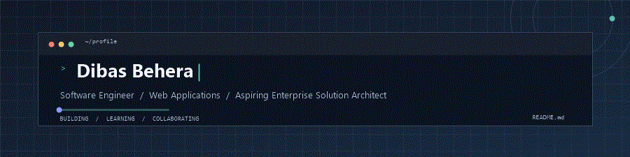

  

  <a href="https://github.com/dibasbehera7?tab=repositories">REPOSITORIES</a>
  &nbsp; / &nbsp;
  <a href="https://www.linkedin.com/in/dibasbehera/">LINKEDIN</a>
  &nbsp; / &nbsp;
  <a href="https://www.hackerrank.com/dibasbehera">HACKERRANK</a>
  &nbsp; / &nbsp;
  <a href="https://instagram.com/connectdibas">INSTAGRAM</a>

 

### About Me

I'm a software engineer with over 8 years of experience in the software industry. I specialize in building web applications and have worked on diverse enterprise projects across multiple clients. I enjoy tackling challenging problems and am currently pursuing a career path toward becoming an enterprise solution architect.

<table width="100%">
  <tr>
    <td width="33%" valign="top">
      01 / EXPERIENCE 
      <strong>8+ years in software</strong> 
      Enterprise projects across multiple clients.
    </td>
    <td width="33%" valign="top">
      02 / SPECIALTY 
      <strong>Enterprise web applications</strong> 
      Java · J2EE · Spring · Microservices · AWS
    </td>
    <td width="34%" valign="top">
      03 / CAREER PATH 
      <strong>Enterprise Solution Architect</strong> 
      Pursuing this path; currently learning system design.
    </td>
  </tr>
</table>

### Technologies

  <code>Java</code> <code>J2EE</code> <code>Spring</code>
  <code>Microservices</code> <code>AWS</code> <code>System Design</code> 
  <code>C</code> <code>C++</code> <code>JavaScript</code>
  <code>HTML</code> <code>CSS</code>

  Made with ❤️ 🇮🇳, Powered by GitHub

